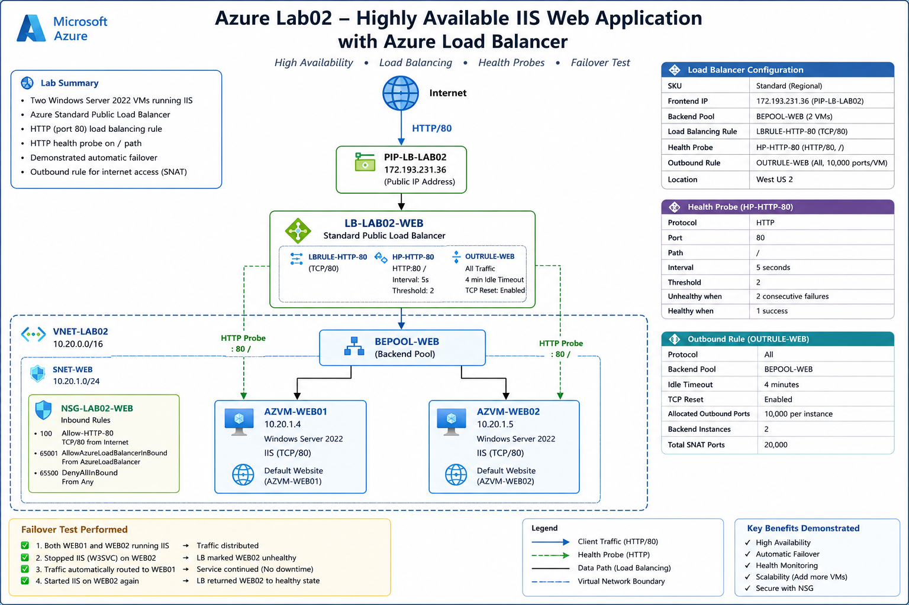
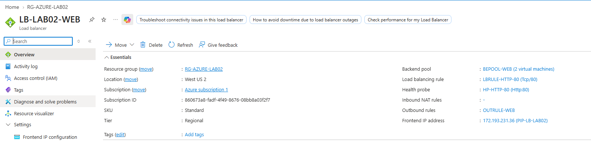
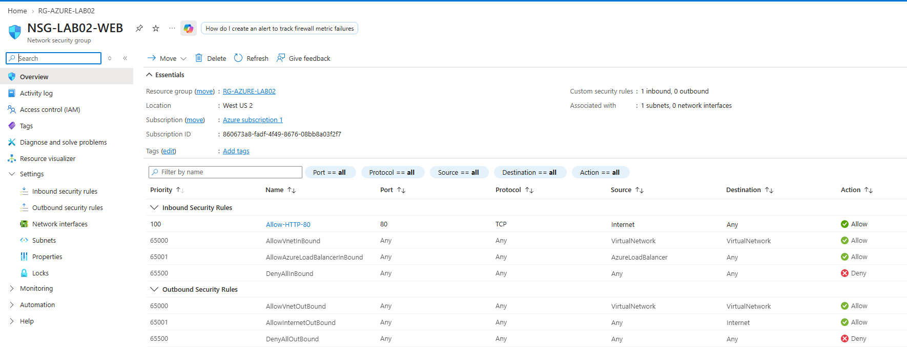
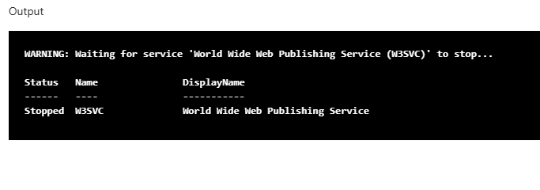
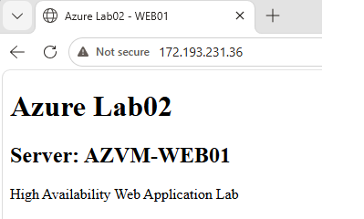

# Azure Lab02 – Highly Available IIS Web Application with Azure Load Balancer

## Overview

This lab demonstrates the deployment and testing of a highly available web application architecture in Microsoft Azure.

Two Windows Server 2022 virtual machines running IIS were deployed as backend web servers behind an Azure Standard Public Load Balancer.

The lab also included HTTP health monitoring, Network Security Group rules, explicit outbound connectivity, and a controlled failover test to verify that application traffic continued when one IIS backend became unavailable.

## Architecture



### Traffic Flow

```text
Internet
   |
   | HTTP/80
   v
Public IP
PIP-LB-LAB02
   |
   v
LB-LAB02-WEB
Azure Standard Public Load Balancer
   |
   | LBRULE-HTTP-80
   |
   v
BEPOOL-WEB
   |
   +-----------------------+
   |                       |
   v                       v
AZVM-WEB01             AZVM-WEB02
10.20.1.4              10.20.1.5
Windows Server 2022    Windows Server 2022
IIS / TCP 80           IIS / TCP 80
```

## Azure Resources

| Resource               | Name             |
| ---------------------- | ---------------- |
| Resource Group         | `RG-AZURE-LAB02` |
| Virtual Network        | `VNET-LAB02`     |
| Address Space          | `10.20.0.0/16`   |
| Web Subnet             | `SNET-WEB`       |
| Subnet Range           | `10.20.1.0/24`   |
| Network Security Group | `NSG-LAB02-WEB`  |
| Web Server 1           | `AZVM-WEB01`     |
| Web Server 2           | `AZVM-WEB02`     |
| Load Balancer          | `LB-LAB02-WEB`   |
| Frontend Configuration | `FE-LAB02-WEB`   |
| Public IP              | `PIP-LB-LAB02`   |
| Backend Pool           | `BEPOOL-WEB`     |
| Health Probe           | `HP-HTTP-80`     |
| Load Balancing Rule    | `LBRULE-HTTP-80` |
| Outbound Rule          | `OUTRULE-WEB`    |

## Network Design

The virtual network used the following address space:

```text
VNET-LAB02
10.20.0.0/16
```

The backend web servers were deployed into:

```text
SNET-WEB
10.20.1.0/24
```

The VMs received private addresses:

```text
AZVM-WEB01 → 10.20.1.4
AZVM-WEB02 → 10.20.1.5
```

Neither backend VM was assigned an individual public IP address.

## Network Security

`NSG-LAB02-WEB` was associated with the web subnet.

The primary custom inbound rule was:

| Priority | Rule            | Source   | Protocol | Port | Action |
| -------: | --------------- | -------- | -------- | ---: | ------ |
|      100 | `Allow-HTTP-80` | Internet | TCP      |   80 | Allow  |

Direct Internet-facing RDP access was not enabled for the backend virtual machines.

Azure VM Run Command was used for remote administration during the lab.

## Web Servers

Both virtual machines were deployed using:

* Windows Server 2022 Datacenter Azure Edition
* 2 vCPUs
* 4 GiB RAM
* Standard SSD OS disk
* IIS Web Server role

Each web server hosted a simple page identifying the responding backend.

### WEB01

```text
Azure Lab02

Server: AZVM-WEB01

High Availability Web Application Lab
```

### WEB02

```text
Azure Lab02

Server: AZVM-WEB02

High Availability Web Application Lab
```

This made it possible to identify which backend server processed each request.

## Azure Load Balancer

The solution used:

```text
LB-LAB02-WEB
Standard Public Load Balancer
Regional
```

### Frontend

```text
FE-LAB02-WEB
PIP-LB-LAB02
```

During the lab, the assigned public IP was:

```text
172.193.231.36
```

The resource group has since been deleted after completion of the lab.

## Backend Pool

The backend pool contained both IIS servers:

```text
BEPOOL-WEB

AZVM-WEB01 → 10.20.1.4
AZVM-WEB02 → 10.20.1.5
```

## Load Balancing Rule

The HTTP load-balancing rule was configured as:

```text
Name:          LBRULE-HTTP-80
Protocol:      TCP
Frontend Port: 80
Backend Port:  80
Backend Pool:  BEPOOL-WEB
Health Probe:  HP-HTTP-80
```

## Health Probe

An HTTP health probe monitored the IIS web service:

```text
Name:     HP-HTTP-80
Protocol: HTTP
Port:     80
Path:     /
```

Only healthy backend servers remained eligible to receive new application traffic.

## Outbound Connectivity

The backend virtual machines were deployed without individual public IP addresses.

Explicit outbound connectivity was configured through:

```text
OUTRULE-WEB
```

The outbound rule used the Load Balancer frontend public IP for outbound SNAT connectivity.

The configuration allocated:

```text
10,000 outbound ports per backend instance
```

## High Availability Test

A controlled failure test was performed to verify the design.

### Initial State

Both IIS servers were running:

```text
AZVM-WEB01 → Healthy
AZVM-WEB02 → Healthy
```

Browsing to the Load Balancer public IP returned:

```text
Server: AZVM-WEB02
```

This confirmed that WEB02 was successfully serving traffic through the Azure Load Balancer.

### Failure Simulation

The IIS World Wide Web Publishing Service was stopped on `AZVM-WEB02`.

```powershell
Stop-Service W3SVC
Get-Service W3SVC
```

The service status confirmed:

```text
Status : Stopped
Name   : W3SVC
```

### Failover Result

After the health probe detected that WEB02 was no longer responding to HTTP requests, a new connection to the same Load Balancer public IP returned:

```text
Server: AZVM-WEB01
```

The application therefore remained available even though IIS on WEB02 had been stopped.

### Recovery

IIS was subsequently restored on WEB02:

```powershell
Start-Service W3SVC
Get-Service W3SVC
```

WEB02 was then able to return to the healthy backend pool.

## Failover Flow

```text
Normal Operation

               LB-LAB02-WEB
                    |
             +------+------+
             |             |
             v             v
          WEB01          WEB02
          Healthy        Healthy


WEB02 Failure

               LB-LAB02-WEB
                    |
             +------+------X
             |
             v
          WEB01          WEB02
          Healthy        Unhealthy
             |
             v
       Traffic continues
```

## Test Evidence

### Load Balancer Configuration



### NSG HTTP Rule



### WEB02 IIS Failure



### Successful Failover to WEB01



## Skills Demonstrated

This lab provided hands-on experience with:

* Azure Virtual Networks
* Subnet design
* Network Security Groups
* Windows Server 2022 virtual machines
* IIS Web Server
* Azure Standard Load Balancer
* Public frontend IP configuration
* Backend pools
* HTTP health probes
* Layer 4 load-balancing rules
* Outbound SNAT rules
* Azure VM Run Command
* High availability
* Health monitoring
* Failure simulation
* Automatic traffic failover
* Azure resource cleanup

## Key Result

The lab successfully demonstrated application-level high availability.

When IIS on `AZVM-WEB02` was deliberately stopped, Azure Load Balancer health monitoring detected the failed backend and subsequent web traffic continued through `AZVM-WEB01` using the same public frontend IP.

## Cleanup

After testing and collecting the required screenshots, the complete lab environment was removed by deleting:

```text
RG-AZURE-LAB02
```

This removed the temporary Azure resources created specifically for the lab.

---

**Lab:** Azure Lab02
**Platform:** Microsoft Azure
**Workload:** Windows Server 2022 / IIS
**Focus:** Load Balancing, High Availability, Health Monitoring and Failover
